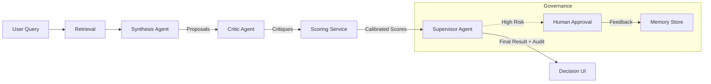

# WIFF: Memory-Augmented Agent System

## Problem Statement
Standard LLM agents suffer from **catastrophic amnesia**. They operate brilliantly within a single context window but fail to carry knowledge across sessions, learn from their mistakes, or build a cohesive model of the user over time. To build a "Senior Engineer" agent (like Hyperspell) rather than a "Junior Script", you need persistent, structured memory.

## Why Memory Matters
- **Continuity**: An agent shouldn't need the same "Project Context" file pasted 50 times.
- **Learning**: If I correct the agent's SQL syntax once, it should never make that mistake again.
- **Personalization**: The agent should learn *my* coding style, not just generic PEP-8.

## Architecture Overview
This system implements a **Hybrid Retrieval & Reflection Loop**:

1.  **Ingestion**: Documents are chunked (semantic) and entities are extracted (graph) to form value-rich indices.
2.  **Retrieval (RAG++)**:
    *   **Vector Search**: Finds semantically similar text chunks (`pgvector`).
    *   **Graph Traversal**: Finds structured entities related to the query (e.g., "Project X" -> "Chimera").
    *   **Recency Ranking**: Exponential decay favors newer information.
3.  **Query Transformation**: Rewrites user queries ("fix it") into standalone statements ("fix the bug in database.py") to prevent context drift.
4.  **Learning (Reflection)**: A post-interaction background job analyzes the chat to "distill" new facts or procedures, updating the knowledge graph automatically.

### Stack
- **Runtime**: FastAPI + Python 3.11+
- **Brain**: OpenAI GPT-4o (or compatible)
- **Memory Store**: PostgreSQL 16 with `pgvector`
- **Orchestration**: Custom (no heavy frameworks like LangChain)

## Key Design Tradeoffs
| Tradeoff | Decision | Rationale |
| :--- | :--- | :--- |
| **Vector vs. Graph** | **Hybrid** | Vectors are fuzzy but fast; Graphs are precise but sparse. We use both to coverage "vibe" queries and "fact" queries. |
| **Read vs. Write Latency** | **Read-Optimized** | We accept slow ingestion (LLM extraction of entities) to pay for fast (<200ms) retrieval and high precision during chat. |
| **Full History vs. Distillation** | **Distillation** | Storing every chat turn creates noise. We use a "Learning" step to compress 100 turns into 1 "Procedural Memory" or "Fact". |

## Mapping to Hyperspell
If this were the engine behind **Hyperspell**:
- **Project Indexing**: When a user adds a repo, we run the *Ingestion* pipeline to build the initial Graph/Vector index.
- **"Remember This"**: The *Learning* service is the backend for the "Remember this preference?" feature.
- **Context Awareness**: The *Query Transformer* ensures that when a user highlights code and says "refactor", the retrieval engine sees "Refactor the `User` class in `models.py`".

## Decision Intelligence System (v2 Upgrade)
Moving beyond simple RAG, the system now features a **Multi-Agent Decision Pipeline** designed for high-stakes enterprise scenarios where "probably right" isn't good enough.

### Architecture Flow
The `DecisionEngine` orchestrates a linear pipeline of specialized agents:

1.  **Retrieval**: Fetches relevant facts/memories.
2.  **Synthesis (The Builder)**: Generates 2-4 viable options. *Focus: Creativity & solutioning.*
3.  **Critic (The Skeptic)**: Reviews options for hallucinations or weak evidence. *Focus: Safety & verification.*
4.  **Scoring (The Actuary)**: Calibrates confidence scores based on evidence density and recency. *Focus: Normalization.*
5.  **Supervisor (The Boss)**: Selects the best option and enforces governance rules (e.g., auto-approve vs. pending). *Focus: Strategy & compliance.*

### Real-World Use Cases
-   **Architecture Review**: Choosing between AWS Lambda vs. Fargate based on memory of past project constraints.
-   **Security Triage**: Deciding whether to block an IP based on threat intellgence (memory) and impact analysis.
-   **Compliance**: Automating routine approvals while flagging edge cases for human officer review.

### Trade-offs & Limitations
| Trade-off | Choice | Consequence |
| :--- | :--- | :--- |
| **Speed vs. Reliability** | **Reliability** | The Multi-Agent pipeline adds latency (3-5 LLM calls). This is acceptable for decisions that take minutes/hours for humans, but not for real-time chat. |
| **Confidence vs. Safety** | **Pessimism** | We intentionally penalize confidence (via Scoring & Critic) to avoid "confident hallucinations." This leads to more "Pending Review" states but fewer catastrophic errors. |
| **Flexibility vs. Audit** | **Structured** | Usage of forced JSON schemas limits the "chatty" nature but enables rigorous audit logging and programmatic API consumption. |

### Governance & Feedback Loop
-   Decisions with **<80% confidence** or **High Impact** trigger a `PENDING` state.
-   User feedback (Approve/Reject) is **ingested back into memory**, creating a reinforcement loop where the system learns from its rejection.

---
*Built for the 2025 Deepmind Agentic Coding Challenge.*
